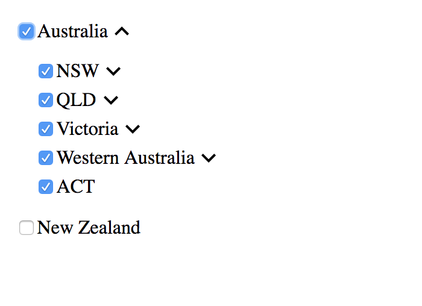

# React-tree
A simple React Tree Component with minimal styling

# Example
npm install && npm start

```const source = [
  {
    id: 1,
    label: 'Australia',
    isExpand: true,
    children: [
      {
        id: 11,
        label: 'NSW',
        children: [
          {
            id: 111,
            label: 'Sydney'
          },
          {
            id: 112,
            label: 'Central Coast'
          }
        ]
      },
      {
        id: 12,
        label: 'QLD',
        children: [
          {
            id: 121,
            label: 'Gold Coast'
          },
          {
            id: 122,
            label: 'Sunshine Coast'
          }
        ]
      },
      {
        id: 13,
        label: 'Victoria',
        children: [
          {
            id: 131,
            label: 'Melbourne'
          }
        ]
      },
      {
        id: 14,
        label: 'Western Australia',
        children: [
          {
            id: 141,
            label: 'Perth'
          }
        ]
      },
      {
        id: 15,
        label: 'ACT'
      }
    ]
  },
  {
    id: 2,
    label: 'New Zealand'
  }
];
```

